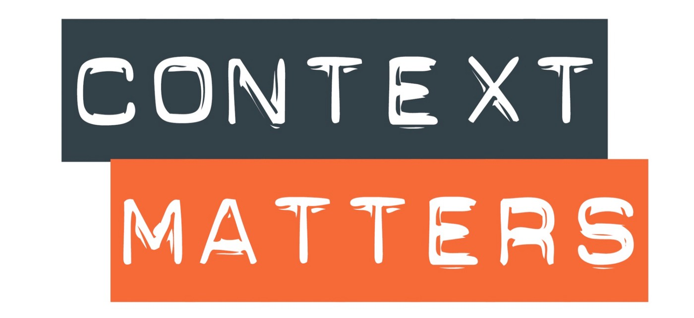

# Learning Practical Path 

**[TO BE TESTED]**


## Chapter 0 - You Said "Learning Path" ? 

This README is here to explain the step by step learning path from Zero to Hero as a Data Engineer. 

As a new comer, Devoteam G Cloud has given you **your first real mission**. Do not be afraid, it is not for real, but it is **realistic**. If you finish your journey, you will be completely able to realize a wonderful mission for your next-to-come clients. 

This learning path, as it names indicates, is a practical path to learn as much as possible in a short period of time. It will be intense but really funny as you will learn through a near-real context. This last point will be really valuable to be ready as a Data Engineer. 


The project is huge, yes, but it will be broken into smaller steps. 

Each step will be decomposed into 3 parts. 

### A Context



You will not work for nothing and for no reason. Everything will be related to a customer requirement which is common in our job. This will help you to understand in what the GCP service you use fits into for a business requirement.


### Learning Resources


Speaking of GCP services, at each step, you will learn to use a new service (BigQuery, GCS, Cloud Function, etc.). **It is not a rush, take your time, go through every ressources we will provide**. 

To be a really efficient Data Engineer, you always need to have theorical knowledge on your tools. It will provide you a way to approache the advantages and the limits of every services for specific use cases.

Again, take your time to understand everything things well and do not hesitate to complete this with other ressources you will find. During this journey, you will be asked to be more and more autonomous. But no worry, **your colleagues are the bests so you can always count on them**. 😉

### A Mission


Learning by doing is the best approach to learn new stuff. 

You will be guided in your mission. You can have objective to complete (must to have), objectives to improve your work (nice to have) and objective to perfect your job (great to have). You are not forced to complete the nice and great to have. Enjoy your mission this is what matters ! 😎

```
Pro tips: 
We cannot repeat it enough, but take your time, do not hesitate to look for other resources on Google documentations, StackOverflow and even from your great new colleagues.
```


### Final Words

Of course, this Learning Practical Path is focused on what a Data Engineer must know and do in it daily life. 

So the main external ressource will be the [Google Certified Professional Data Engineer](https://learn.acloud.guru/course/gcp-certified-professional-data-engineer/) from [A Cloud Guru](https://acloudguru.com/) which is a awesome courses. 

Your manager has probably asked you to begin with the** Cloud Digital Leader** or the **Associate Cloud Engineer**. That is fine and the right path. 
This Learning Path will not give you all the knowledge to pass the Professional Data Engineer certification, but it will help you a lot when you will have to pass it the nexts months. 


