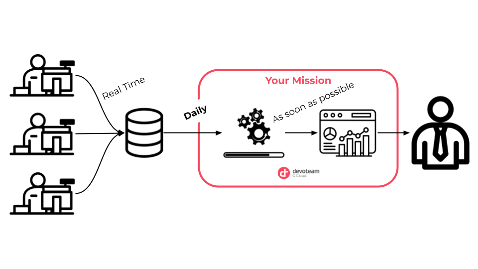
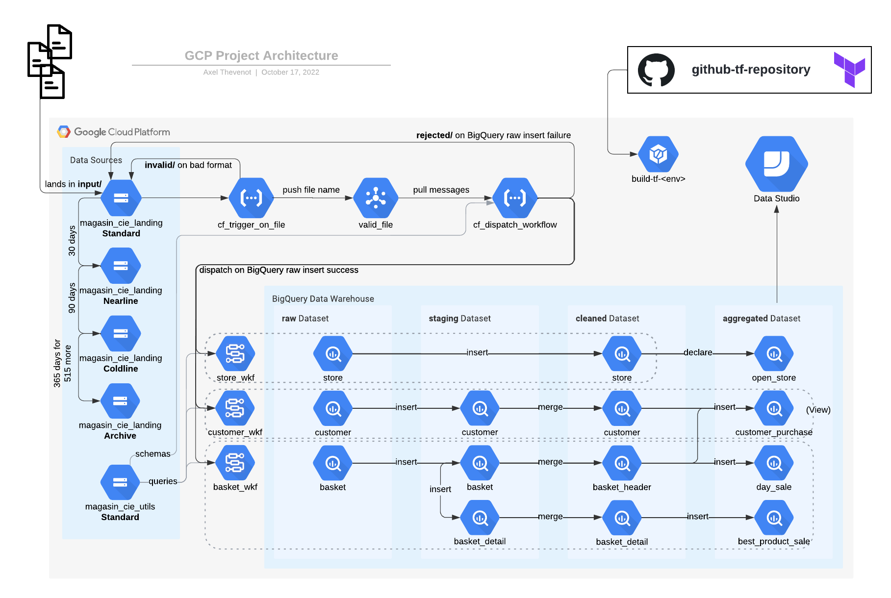

# Learning Practical Path 

## Chapter 1 - Quick introduction to Data processing fundamentals. (2-3 days) 

### The Context

In a **retail** context, we were chosen by the company Magasin & Cie to meet the **needs of managers**. The latter would like to have a **daily** overview of the sales and customers who bought in their store via a **personalized dashboard**. 

At Magasin & Cie, an **european** company, **each cash register records purchases in real time** and sends them to the **internal** database of all the stores. The data is stored in **different formats** and is **not processed**. For the time being, it is only used to keep track and **archive** the transactions made at Magasin & Cie.

The data and **KPIs** of the reporting dashboard needed are clearly defined and thanks to the great work of our sales team and Devoteam's Tech Lead, the **interface contracts** and the different **mappings** are already established.

#### Your role at Devoteam

Your objectives are: 
    - to ingest the data from the internal database into a GCP Project Data Lake
    - to process the data and extract the important informations to best fit the managers needs. 
    - to make it accessible at any time by creating a dashboard that managers can view at any time.

#### Do not be afraid but...

... you will create during this learning path an architecture, which will have an architecture like below. 

### Your mission

Exceptionally, your mission at this stage starts before the learning resources.

Ask for a personal sandbox to your Crew Manager. 

When it is done. Ask him to explain you shortly what `IAM` is and add your Crew Manager as a Project Viewer to your sandbox. 

#### Installations

If not already done, install on your machine your favorite IDE (VS Code by default). 
Install git and configure you Devoteam G Cloud Github account. 

When it's done, go to the `README.md` at the root of this repository and follow the different steps. 

To finish, you can install Python on your local machine

**Optionnal:**
If you have VS Code install on your machine I highly recommend you the following extensions:
- autoDocstring - Python Docstring Generator
- Color Highlight
- Git Extension Pack
- Git Graph
- GitLens
- Terraform
- (PyLint)

### The Learning Resources

To best perform in your mission, you will need to be comfortable with GCP. 

A Cloud Guru is a plateform where you can find really rich content on the Cloud in general. It really help to pass Cloud Certifications and of course to be learn efficiently new concepts or services. This is why it is highly recommended to have a look to A Cloud Guru's courses. 

You can (re)activate your A Cloud Guru account completely independently.
To do so, go to: acloudguru.devoteamgcloud.com

Go to the [Google Certified Associate Cloud Engineer 2020](https://learn.acloud.guru/course/gcp-certified-associate-cloud-engineer/dashboard):
- Be more comfortable with GCP following the chapters 1-4 to introduce GCP.
- Have a look at two very basic services (GCS & GCE) with the chapter 7 and optionaly have fun with the chapter 8 on your sandbox.
- Then, a really, **really**, **REALLY** important concept on GCP is IAM (no, no, not the Hip hop group 😜). Complete the Chapter 10 to know more.

**Bonus**: [Google Cloud Developer Cheat Sheet](https://googlecloudcheatsheet.withgoogle.com/)
