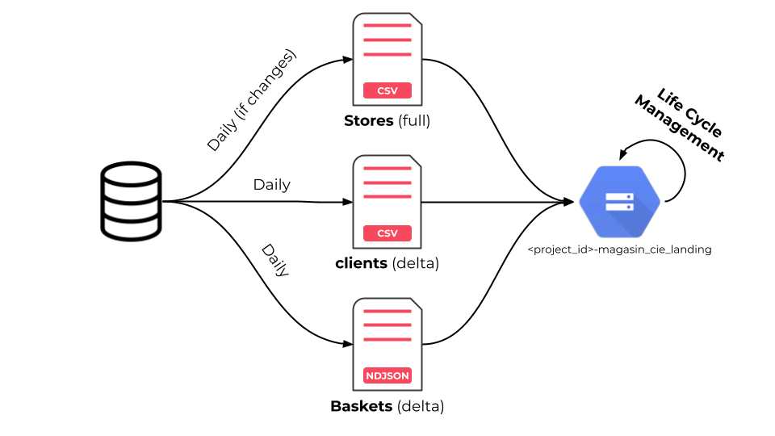
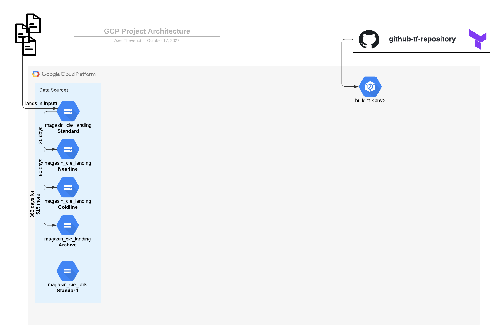

# Learning Practical Path 
 
## Chapter 2 - Google Gloud Storage & Lyfecycle Management (1 day)
### The Context

As an interface between your GCP project and the internal database of  Magasin & Cie, you need to store the received data in place. This is not a random place. This place must accept every file coming. This means, it has to accept every extension, formats. This place is typically named a Data Lake. 

This is a term you will hear a lot. A Data Lake brings together data from across the enterprise into a single location. So, you might get the data from a relational database or from a spreadsheet, and store the raw data in a Data Lake. This raw data can be CSV, JSON, Avro, or even png or mp4. 

As a Data Engineer, you will often use a Cloud Storage bucket as part of your Data Lake and then load or query them directly from BigQuery as a Data Warehouse.

This is an other term you will hear a lot. Unlike a Data Lake, where the data is in the raw format, in the Data Warehouse, the data is stored in a way that makes it efficient to query (Does it start to echo the initial context? ). 

### The Learning Resources

Go to the [Google Certified Data Engineer course on A Cloud Guru](https://learn.acloud.guru/course/gcp-certified-professional-data-engineer/dashboard):

You are developping a Data Processing Pipeline so it can be interested to have more knowledge on what Data Processing first. Check for the chapter 2. 
Moreover, as a start of your pipeline, you will need a Google Cloud Storage bucket. So you can continue with the Chapter 3 until the "Cloud Storage" subsection.

For more practice, go to the [Learn Google Cloud by Doing](https://learn.acloud.guru/course/a872a5e6-b6b6-493b-ba82-f8dba48c161c/overview) and have fun with the Chapter 3. 

Of course, nothing is better than the Google Cloud documentations. Let's have a look to the [Google Cloud Storage Documentation](https://cloud.google.com/storage).

But let's get back to our context. In order to receive and store the data coming from the internal database of Magasin & Cie. We will set up a Cloud Storage bucket. 

In addition to that, we will certainly need another bucket in which we can place files specific to the needs of the application we are building.

### Your mission

#### Landing CGS Bucket

Create a GCS Bucket named `<your-project-id>_magasin_cie_landing`.

It let you discuss with your awesome colleagues about:
- the best Location type 
- the others parameters (maybe one or more parameters is not as suitable as possible with its default value)

Create LifeCycle rules as:
- Set the `archive/`-prefixed objects to `Nearline` when they are in the bucket for 30 days.
- Set the `archive/`-prefixed objects to `Coldline` when they are in the bucket for 90 days.
- Set the `archive/`-prefixed objects to `Archive` when they are in the bucket for a year.
- nice to have: Delete the 5-year-old-`archive/`-prefixed objects.

#### Utils CGS Bucket

Create a GCS bucket named `<your-project-id>_magasin_cie_utils`.
Is there any need of LifeCycle rules? 

Why do we prefixed our bucket with the project ID? 
Why did we create a second bucket for the files of the application? Why not to use only one bucket for the received files and for the specific application's files with differnt subfolders? 

#### Deployment with gsutil CLI

Once you created the buckets with the GCP Console (UI), try to re-create a new version of those buckets with `gsutil`. I let you check by yourself for the [gsutil documentations](https://cloud.google.com/storage/docs/gsutil). 

#### Deployment with Terraform

If you are confortable with the notions you have just seen. See the `terraform` part in the `iac/` folder. 

You can uncomment the code to see what happens in the Cloud Build Trigger.

At least one bucket configuration is missing in the Terraform. Your last task is to find this and fix it.
The [Storage Bucket documentation](https://registry.terraform.io/providers/hashicorp/google/latest/docs/resources/storage_bucket) of Terraform will help you.
