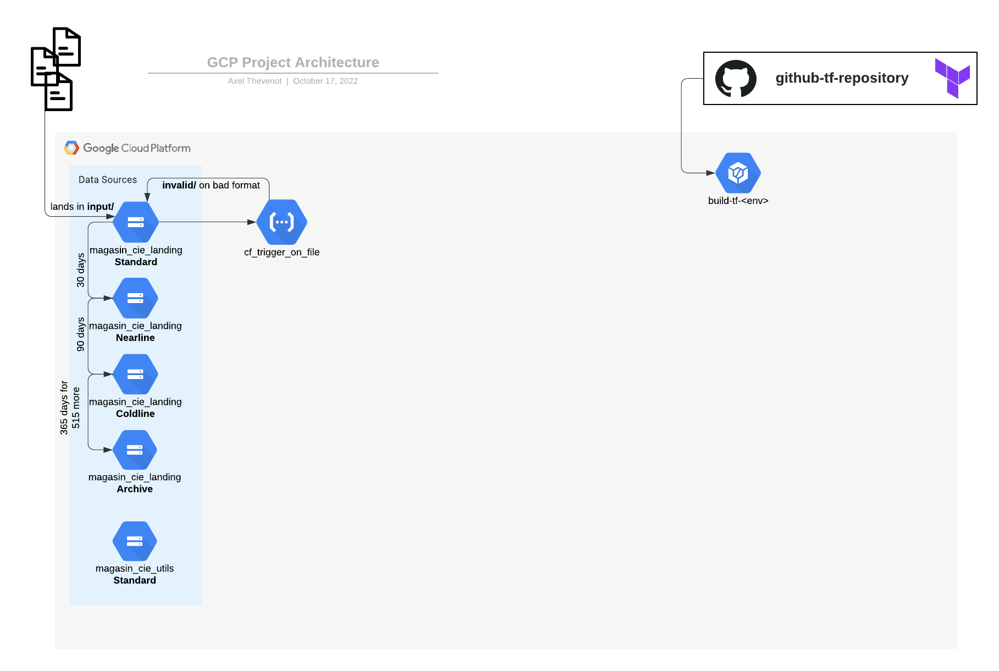

# Learning Practical Path 


**[TO BE TESTED]**

## Chapter 3 - Cloud Function & Python (1-2 days)



### The Context

Your bucket is now in place and is ready to be used to get the files from Magasin & Cie. 
Of course, a file in a bucket is not really useful so we will then integrate it to get great insights. 

In this context, as soon as a file arrive in the bucket. We want to perform so verification on the file. 
The requirements given to Magasin & Cie to have a pipeline ready to use is to have well formatted & defined files sent to our bucket. 

We asked for the files:
- to be put in a subfolder `input/`.
- to be prefixed with the corresponding data it contains. (`store`, `customer`, `basket`)
- to be suffixed with the sending date as `YYYYMMDD`. (example: `20220301` for March, 1st of 2022.)
- to have the correct extension:
    - CSV for stores and customer files.
    - JSON for the basket files.


### The Learning Resources

Here a great course on Cloud Function. Will will have theoritical knowledge on Cloud Function as well as hands-on experience through the labs it provides. Go to the [Google Cloud Functions Deep Dive](https://learn.acloud.guru/course/8bd9dcda-5bb8-4049-bcd9-870d93698486/overview) to be a Cloud Function expert ;)

And of course, nothing is more useful than the [Google Cloud Function documentation](https://cloud.google.com/functions).
### Your mission

Complete the list of Python assertions to check the format of the files. 
The Cloud Function code is in the `cloud_functions/cf_trigger_on_file/` folder.

It will move the invalid files to the `invalid/` subfolder and leave the correct files to the `input/` subfolder to be inserted right after. 

Then it informs as a PubSub Topic Published for the name of the file to insert (as well as the targeted table where to insert. Do not worry about this part, we will see it in the next Chapter.)

**To test your code, please, use the `__materials__/data/init/` files**

#### Deployment with gsutil CLI

If you used the Cloud Console UI in the previous part, you can now try to use the CLI to deploy your Cloud Functions.
Deploy the Cloud Function with the `gcloud` CLI. Go check by yourself for the documentation.
```
gcloud functions deploy file_checking --region=europe-west1 --runtime python310 --source=src/ --entry-point=check_file_format --trigger-bucket=gs://sandbox-lhanot_magasin_cie_landing --allow-unauthenticated
```

#### Deployment with Terraform

Then, when you are confortable with Cloud Function, you have to create the Terraform deployement of the Cloud Function in the `iac/cloud_functions.tf` file. 
Go to the Codelab [Deploy Cloud Functions on GCP with Terraform](https://codelabs.devoteamgcloud.com/codelabs/cloud_function_terraform/index.html). 


When everything is done and works well, if not already done, you can activate the `move_to_invalid_file_folder()` function in the `cloud_functions/cf_trigger_on_file/src/main.py` file.

