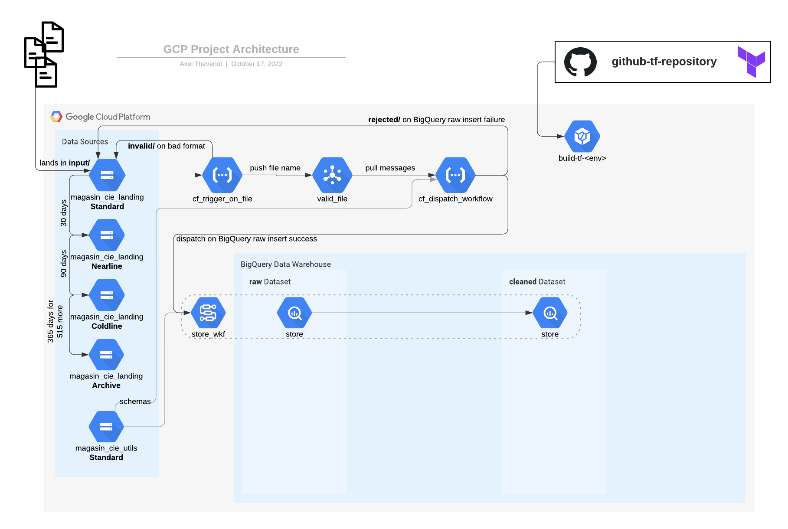

# Learning Practical Path 

**[TO BE TESTED]**

## Chapter 4 - Cloud PubSub & Cloud Client Libraries (1-3 days)

### The Context
Any file that comes to your bucket has already passed a bunch of tests during the chapter 3 to ensure data conformity. It now needs to be uploaded on a BigQuery data warehouse, then archived in an other Google Cloud Storage bucket. Finally, you will have to trigger the workflow that will apply all the transformation to these raw data and thus defining the transformation pipeline.

All of these actions, like in the chapter 3, will be performed thanks to a Cloud Function.

### The Learning Resources

At this point, you already have made your first Cloud Function to filter files based on their name. 
The second Cloud Function you will create in this part will perform integrate those files. Yet how do we message this second Cloud Function when needed ? This is all the point of PubSub. 

To have a good understanding of what PubSub is and permits, you can first start your journey with what Kafka is. 
So let's go to the [Google Certified Professional Data Engineer](https://learn.acloud.guru/course/gcp-certified-professional-data-engineer/overview) course on A Cloud Guru and see the video "Apache Kafka" in the Chapter 4. 

Now you are aware of what a messaging bus is, you can go through the Chapter 5 of this course. 
Of course you can always see the [PubSub documentation](https://cloud.google.com/pubsub/docs/overview).

In this Chapter, you will also have your first approach with BigQuery and Cloud Workflows. Do not worry about those services, they will be covered in the next chapters. Yet it is still a good point to know in a high level what are those services as you will interact with them in this chapter. 

BigQuery is a datawarehouse. In a nutshell, it is both a storage location and a provides a computing engine to perform analysis on your data. You will interact with you data with SQL queries.

See [BigQuery documentation](https://cloud.google.com/bigquery).

Workflows can be seen as a pipeline, it means, a serie of task to perform. It orchestrates a serie of executions/tasks. Those tasks run with API calls. For our case, API calls to BigQuery to perform a serie of transformation on your data. 

See [Workflows documentation](https://cloud.google.com/workflows).

As already said, you will interact with BigQuery, Workflows and Cloud Storage in this chapter. Those interactions will be made with the Python SDK in the Cloud Function almost each GCP service has a Client Librairy associated. 

> "The Cloud Client Libraries are the recommended way to access Google Cloud APIs programmatically. The Cloud Client Libraries support accessing Google Cloud services in a way that significantly reduces the boilerplate code you have to write." - [Python Cloud Client Libraries](https://cloud.google.com/python/docs/reference)

See [Python Cloud Client Libraries documentation](https://cloud.google.com/python/docs/reference).

See [Python Cloud Client Libraries documentation for Storage](https://cloud.google.com/python/docs/reference/storage/latest).

See [Python Cloud Client Libraries documentation for BigQuery](https://cloud.google.com/python/docs/reference/bigquery/latest).

See [Python Cloud Client Libraries documentation for Workflows](https://cloud.google.com/python/docs/reference/workflows/latest).

### Your mission

Before we start, we need to introduce what an "Interface Contract" is (also named "File Interface Agreement").

An interface agreement is a document that defines an interface between two teams/sites/functional responsibilities. In other words and in this example, it is the document, which provides the format and the structure of the file we are receiving. For Magasin & Cie, it is the format and the structure of the files sent. It is a contract to establishes and guarantee the connection between us to serve as a reference and prevent errors.

The mappings and the interface contracts were made by your Tech Lead so you can see them in the [Interface Contracts & Mappings](https://docs.google.com/spreadsheets/d/1hprnjaLq3v4GDfckOW3QHVKN8b9EOMtS6kLVJc-U7KQ/edit?usp=sharing) file in the `Interface Contracts` tab.

(A "mapping" is also a document which will be seen in the next chapters)

#### Prepare the environment with Terraform

Now, I know, you are confident with Terraform so you can prepare you architecture environment directly in Terraform.

> hint: you first can do it manually with the Cloud Console to note every action you have to made. Then it will be easier to retranscribe in Terraform.

In the file `iac/bigquery.tf`:
- Create a BigQuery dataset named `raw` in location `EU`.
- Create a BigQuery dataset named `cleaned` in location `EU`.
- Create a BigQuery table `store` in the dataset `raw` (schema is `schemas/raw/store.json`).
- Create a BigQuery table `store` in the dataset `cleaned` (schema is `schemas/cleaned/store.json`).
  
In the file `iac/cloud_storage.tf`:
- In the `gs://<project_id>_magasin_cie_utils/` bucket, add all the content of the folders `queries/` and `schemas/`.

In the file `iac/worfklows.tf`:
- Create the Workflows `store_wkf` in region `europe-west1` with `cloud_workflows/store_wkf.yaml` as its source content.

In the file `iac/pubsub.tf`:
- Create a PubSub topic named `valid_file`.

#### Cloud Function to trigger the workflow.

The Cloud Function code is in the `cloud_functions/cf_dispatch_workflow/` folder.

**To test your code, please, use the `__materials__/data/20220601/store_20220601.csv` file**
So even it you have the interface contract for all the files, we will only be concentrated on the store files in this chapter.

Your mission here is to interact with every GCP services in your Cloud Function to ingest the data into BigQuery. 
Your Cloud function must be triggered as a Subscriber to your PubSub topic.

Then you can fill in the code of the Cloud Function as indicated in the `cloud_functions/cf_dispatch_workflow/src/main.py` file.
You can `CRTL+F` on `TODO: 1` then `TODO: 2` and `TODO: 3`.

When everything it done and works well, if not already done, you can activate the `publish_to_pubsub()` function in the `cloud_functions/cf_trigger_on_file/src/main.py` file. And try the full Cloud Function to BigQuery pipeline. You will see your cleaned data ingested in the BigQuery table `<project_id>.cleaned.store`.

(You also can intergrate the `__materials__/data/init/store_20220531.csv`)

