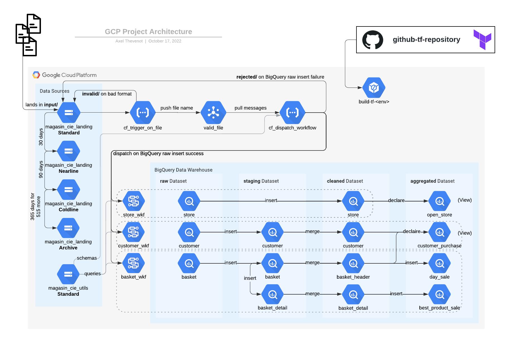

# Learning Practical Path 

## Chapter 6 - Advanced SQL & GDPR (3 days)



### The Context

Magasin & Cie has qualified both the store table and the customer table in your cleaned dataset. Their are impressed by you work. 
But now they want to ingest another file which is more difficult to handle and is bigger than the others. 
You have to ingest the sales of Magasin & Cie from the basket files, which are JSON files. 

Then they want you to create a dataset with aggregated tables to be ready to create the dashboards for the managers. 

### The Learning Resources

At this stage, yes yes it will be harder but I think you will be more autonomous. So for the last time, I will give you some links to without explaining anything. It can or can not be useful. And of course, it is not exhaustive!

BigQuery
- [Partitioned Tables](https://cloud.google.com/bigquery/docs/partitioned-tables)
- [Views](https://cloud.google.com/bigquery/docs/views-intro)
- [Materialized views](https://cloud.google.com/bigquery/docs/materialized-views-create)
- [Clustered tables](https://cloud.google.com/bigquery/docs/clustered-tables)


Nested and repeated fields
- [Nested and repeated fieds](https://cloud.google.com/bigquery/docs/nested-repeated)
- [**Best practices**](https://cloud.google.com/bigquery/docs/best-practices-performance-nested)
- [Working with JSON, Arrays, and Structs in BigQuery](https://www.cloudskillsboost.google/focuses/3696?parent=catalog)
- [SELECT AS STRUCT](https://cloud.google.com/bigquery/docs/reference/standard-sql/query-syntax#select_as_struct)

BigQuery Skill boost
- [Creating a Data Warehouse Through Joins and Unions](https://www.cloudskillsboost.google/focuses/3640)
- [Build and Optimize Data Warehouses with BigQuery: Challenge Lab](https://www.cloudskillsboost.google/focuses/14341)
- [Insights from Data with BigQuery: Challenge Lab](https://www.cloudskillsboost.google/focuses/11988)
- [Getting Started with BigQuery GIS for Data Analysts](https://www.cloudskillsboost.google/focuses/17817)


Others
- [Google](https://www.google.com/) 
- [Stack Overflow](https://stackoverflow.com/)
- **your amazing colleagues**
### Your mission

Your mission here is to complete the full diagram before to finish with the dashboards in the next chapter. 

**For this chapter, you can use every file(s) you want**

I hope you are more autonomous now but here are some hints. 

#### Documentation & context matters

Every information can be retreive from the documentations, or from the context. 

#### Order matters

When it comes to write some code, do you can do it in a smart way. For instance, by default, you can write your code following the pipeline's diagram. 

#### JSON instead of CSV ?

Maybe you will have to rework your second Cloud Function to be able to load all the possible files. 

#### Staging basket table

The `staging.basket` table is really hard to make.
We therefore advise you to follow the following steps to create it.
- start by creating a `staging.basket_temp` table with only the simple transformations from `raw.basket` (the transformations that are not specified just below). For now set id_basket_header to NULL.
- then dedupicate the detail on `product_name` updating the `staging.basket_temp` table in place (really, really hard). 
- create `staging.basket` table joining with `cleaned.basket_header` table to retrieve existing basket headers ids and keep the new header as `NULL`. 
- and update the `staging.basket` table in place to fill the NULL (new) basket headers with an incremental value starting from the last id known in the `cleaned.basket_header` table.
- to be clean, delete the temporary table `staging.basket_temp`.

By the end you will have the completed the pipeline architecture with those files.


#### GDRP

What is GDPR ? Is there any table which is not GDPR compliant ? If yes, what table(s) and why ? 
How can you address this concern ? 

To go further, what BigQuery supports to be GDPR compliant and to secure or protect datasets, tables, columns, rows ? 

This part, although it is only a few lines long, is very very very important! 

The amount of the financial penalties can be up to 4% of the annual worldwide turnover. These sanctions can be made public and thus damage the public reputation of the company in the short and long term.

I invite you to take a look at this [interactive map of the sanctions imposed](https://datalegaldrive.com/lentreprise/nos-outils/carte-sanctions-rgpd/) and made public.


#### Some questions to ask 

What if you ingest a file from the date `D` and then you can to catchup the history and ingest a file from the date `D-1`?
Is this the behaviour you want? If no, how can you address this issue? 

The `aggregated.customer_purchase` is a view. Why does it matters in this situation? What are the limits of Cloud Workflows in this case? 

Do you need some partitions? Some clustering? Why?

#### Your final folder

If you have finished your pipeline, your folder may seems like the following.

```
./
├── README.md
├── cloudbuild.yaml
├── __materials__/
│   ...
│  
├── cloud_functions/
│   ├── cf_dispatch_workflow/
│   │   ├── env.yaml
│   │   └── src/
│   │       ├── main.py
│   │       └── requirements.txt
│   └── cf_trigger_on_file/
│       ├── env.yaml
│       └── src/
│           ├── main.py
│           └── requirements.txt
├── cloud_storage/
│   └── magasin-cie-landing_lifecycle.json
├── cloud_workflows/
│   ├── basket_wkf.yaml
│   ├── customer_wkf.yaml
│   └── store_wkf.yaml
├── iac/
│   ├── backend.tf
│   ├── bigquery.tf
│   ├── cloud_functions.tf
│   ├── cloud_storage.tf
│   ├── init/
│   │   └── init.sh
│   ├── pubsub.tf
│   └── variable.tf
├── queries/
│   ├── aggregated/
│   │   ├── best_product_sale.sql
│   │   ├── customer_purchase.sql
│   │   ├── day_sale.sql
│   │   └── open_store.sql
│   ├── cleaned/
│   │   ├── basket_detail.sql
│   │   ├── basket_header.sql
│   │   ├── customer.sql
│   │   └── store.sql
│   └── staging/
│       ├── basket.sql
│       ├── basket_detail.sql
│       └── customer.sql
└── schemas/
    ├── aggregated/
    │   ├── best_product_sale.json
    │   ├── customer_purchase.json (no need)
    │   ├── day_sale.json
    │   └── open_store.json (no need)
    ├── cleaned/
    │   ├── basket_detail.json
    │   ├── basket_header.json
    │   ├── customer.json
    │   └── store.json
    ├── raw/
    │   ├── basket.json
    │   ├── customer.json
    │   └── store.json
    └── staging/
        ├── basket.json
        ├── basket_detail.json
        └── customer.json
```
