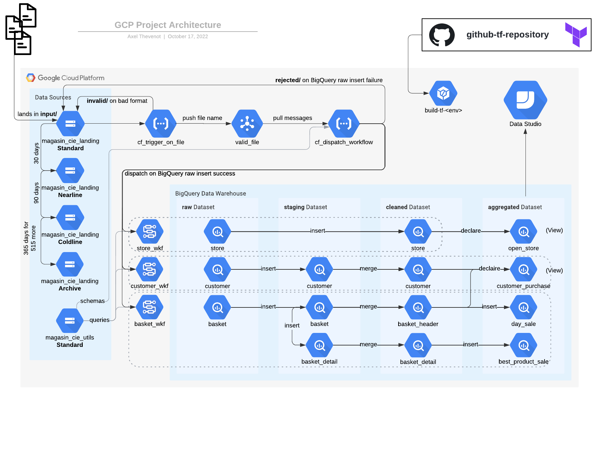

## Learning Practical Path 

## Chapter 7 - Data Studio & Data Visualization Fundamentals (1-2 days)

### The Context

Fantastic ! You should have now the aggregated tables you need. However, the task is not completely done yet. Indeed, you can't imagine a Magasin & Cie manager using only your tables (some of them with thousands and thousands rows of data), to have a great overview of the status of their store or take crucial decisions. 
As precised in the first chapter, you will need to implement for them some dashboards. A dashboard is a visual representation of the data that could be used by some non tech collaborators. It often takes the form of different graphs and charts (from time series chart, to pie chart, or even geographic charts).
What a nice coincidence it exists different Google tools for designing such dahsboards. One of the most frequent and easy to learn is called Data Studio. But that not the only one as you will for example discover a more advanced and fine-grained (and more expensive) tool in chapter 12 which is called Looker.
But let's go back to Data Studio for now, you will have already many things to learn and experiment !

### The Learning Resources

Normally, you should have already followed along six chapters. You should be now able to be quite autonomous.
Thus, we provide you only the Data Studio Help page where you can find he answer to pretty every question you could have. If you really need more help, connect with your colleagues or search for the answer online. I am sure that you are now able to handle it on your own ! 💪

[Data Studio Help](https://support.google.com/datastudio/)

### Your mission

Well, actually, we did not tell you everything ! We indeed already created all the tables in BigQuery and the managers already presented us with a few use cases. Therefore we have already designed some dashboards that allow the managers to gain data insight. You will find some of these examples here : ... @todo
After having seen these and trying to understand how it got implemented. You will have different missions.  
Must to have :  
1- Reproduce the best you can the dashboards already created  
2- Create some well chosen dashboards thanks to the data that are the most relevant according to the managers.
3- A manager is not really familar with BI Vizualisation of data and thus does not know which data is relevant. But he does have some needs and expressed his needs with some questions. Design the best dashboards you thinks of with the correct sources of data to fullfil his demands
Great to have :  
4- Propose some new charts and vizualisations that you think a manager could benefit from.
Nice to have :  
5- Do you have any idea of an other aggregated table (or several tables) that could be great in order to design some new dashboards ?
6- Do you have any remarks on the data used (aggregated, as well as raw, staging and cleaned) ? (see tips)

Tip 1 : Look at your data in BQ or using your Data Studio dahsboards
Tip 2 : Do you remark any weird data ?
Tip 3 : For example, do you think the dashboard(s) you designed for Aziz is/are realistic ?

(ouverture Looker avec les limites de Data Studio)